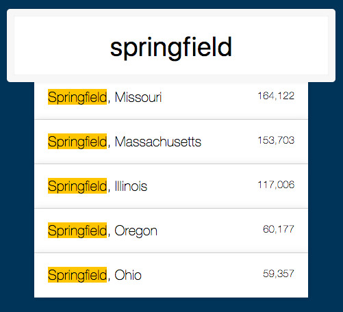

# Ajax-Type-Ahead

A static web page for type suggestions built with only HTML, CSS & JavaScript. This project uses an input field to capture user input in a text box, queries the data and returns a list with the matches on the screen.

It looks something like this:

---

## Notes

Studying this project we learned about:

* Dynamically setting events
* Using regular expressions and regExp variables
* How the query selector can be used to easily interact with many elements

We struggled with:

* How to create the development strategy.
* How to dynamically add eventListeners to HTML elements created at run-time
* Use of regExp variables to create dynamic regular expressions

---

> * Code refactored from [Wes Bos](https://github.com/wesbos/JavaScript30/tree/master/06%20-%20Type%20Ahead)
